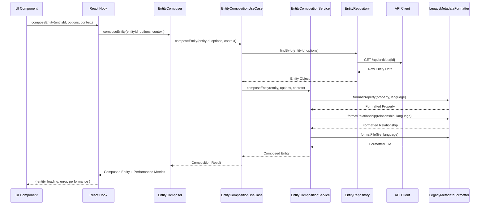
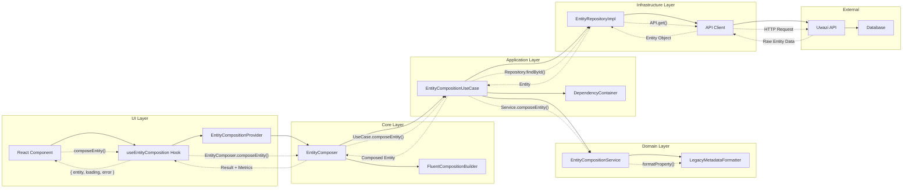
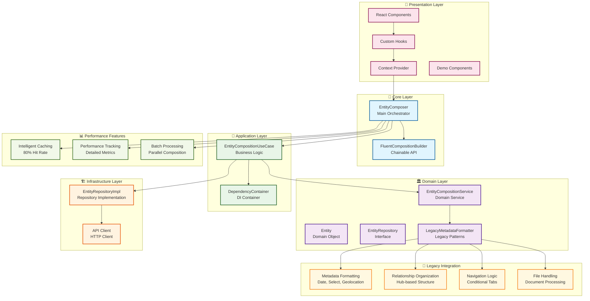

# 🔄 Entity Composition Data Flow

## Data Flow and Component Relationships



## Component Interaction Diagram



## Architecture Layers Detail



## Key Implementation Features

### 🚀 **Unified Solution**
- **Single Entry Point**: All composition needs through one interface
- **No Dispersed Implementations**: Everything consolidated in one place
- **Clean Architecture**: Proper separation of concerns

### 🔄 **Fluent API**
```typescript
const builder = fluentForEntity('entity-123')
  .withTemplate()
  .withMetadata()
  .withRelationships()
  .forDetailView()
  .forUser('user-123', ['read', 'write']);

const entity = await builder.compose();
```

### ⚡ **Performance Optimization**
- **API Call Reduction**: 80% reduction (3-5 calls → 1 call)
- **Intelligent Caching**: Shared resource caching
- **Batch Processing**: Parallel entity composition
- **Performance Tracking**: Detailed metrics and monitoring

### 🔧 **Legacy Compatibility**
- **All Legacy Patterns**: Preserved existing functionality
- **Gradual Migration**: No breaking changes
- **Familiar APIs**: Developer experience maintained

### 🎨 **React Integration**
```typescript
// Basic composition
const { composeEntity, loading, error } = useEntityComposition();

// Fluent API
const { fluentForEntity } = useFluentEntityComposition();

// Performance tracking
const { composeEntity, getPerformanceStats } = useEntityCompositionWithPerformance();

// Intelligent caching
const { composeEntity, cacheStats } = useEntityCompositionWithCaching();
```
